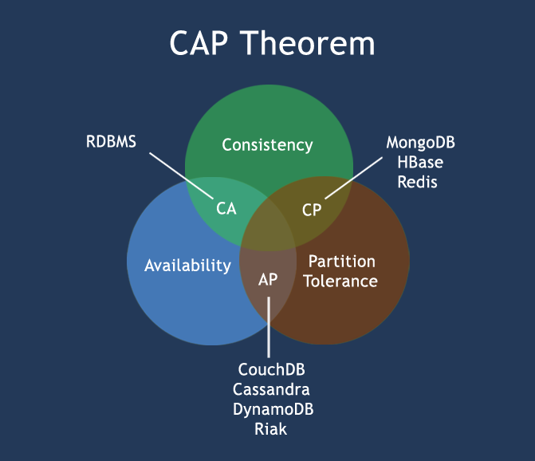
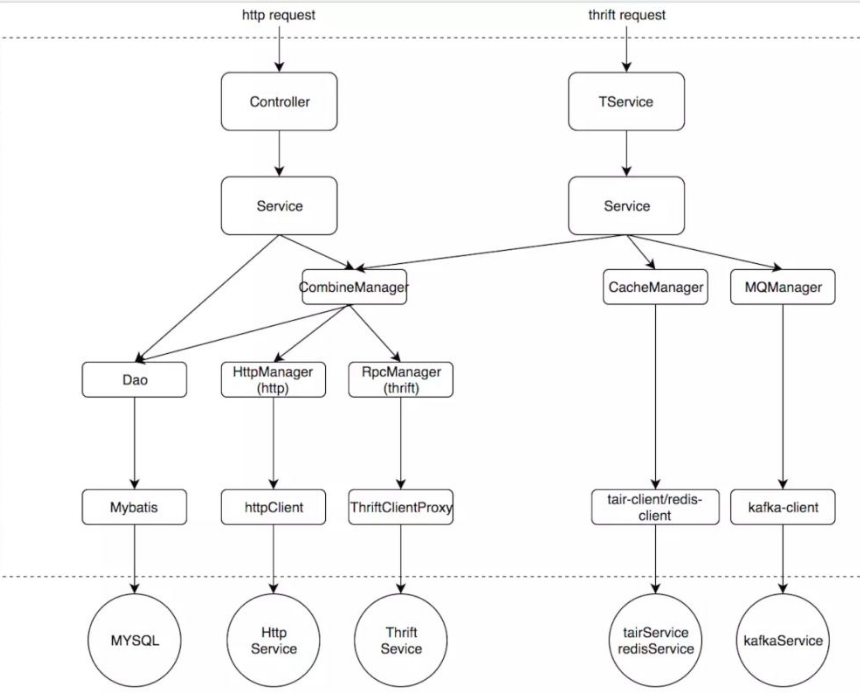

#### 箭头
    ↑ ↓ ← → ↖ ↗ ↙ ↘ ↔ ↕
    ↞ ↟ ↠ ↡ ↢ ↣ ↤ ↥ ↦ ↧ ↨
    ↰ ↱ ↲ ↳ ↴ ↵
    ↶ ↷ ↺ ↻     
    ↼ ↽ ↾ ↿ ⇀ ⇁ ⇂ ⇃
     
#### 错误定位
    ?? error ??
        ↓
      错误提示  → 根据错误提示来定位具体错误，直观错误和非直观错误，使用提示和自身经验定位
        ↓
      API|URL   → 定位具体的代码、是否能够访问、服务器配置（缓存、权限、日志、磁盘上限、内存等）
        ↓
      自身业务代码 → 根据自身经验排查、查看代码、跟踪代码路径
        ↓
      相关联代码 → 业务耦合、关联性比较强、是否受其它业务影响、查看并跟踪代码
        ↓
      非系统业务代码 → 多为公用API、通用代码、核心基础
        ↓
      第三方API调用 → 当前业务可能使用的API，API内可能会涉及缓存，权限，特定文件读取等操作，是否有容错处理
        ↓
      其它错误  → 服务器相关、代码配置、数据库配置等
        ↓
      无法定位 → 模拟完整的请求、按照业务线添加日志、根据日志定位问题
      
#### 基础说明
* CDN (Content Delivery Network): 内容分发网络,
使用户就近获取所需内容，降低网络拥塞，提高用户访问响应速度和命中率

* DNS (Domain Name System): 域名系统（服务）协议

* 高可用HA(High Availability): 通过设计,减少系统不能提供服务的时间

* 高并发HC(High Concurrency): 是互联网分布式系统架构设计中必须考虑的因素之一,
通过设计保证系统能够同时并行处理很多请求。
    * 响应时间：系统对请求做出响应的时间。
        例如系统处理一个HTTP请求需要200ms，这个200ms就是系统的响应时间。
    * 吞吐量(TPS)： Transactions(交易次数) Per-Second 单位时间内处理的请求数量。
    * QPS：Query Per-Second 每秒响应请求数。在互联网领域，这个指标和吞吐量区分的没有这么明显。
    * 并发用户数：同时承载正常使用系统功能的用户数量。
        例如一个即时通讯系统，同时在线量一定程度上代表了系统的并发用户数。
* 分布式系统
    * 分布式(不同业务模块分布到对应的服务器通过API相互访问,公共部分用RPC)[模块] , 集群(同一个系统分布到不同的服务器中)[系统]
    * CAP
~~~
C:Consistency(一致性)      A:Availability(可用性)     P:Partition(分区容错性). 
在分布式系统中，同时满足CAP定律中的一致性 Consistency、可用性 Availability和分区容错性 Partition Tolerance三者是不可能的。
在绝大多数的场景，都需要牺牲强一致性来换取系统的高可用性，系统往往只需要保证最终一致性。
~~~
   
         
#### 分散的知识点可以组合成适合自己业务的架构
    根据自己的业务需求,分析出不同阶段的瓶颈,进行逐步优化.
    没有一层不变的架构,需要不断的设计符合当前业务的架构.        
#### 高并发
* 垂直扩展: 提升单机处理能力
    * 增强单机硬件性能，例如：增加CPU核数如32核，升级更好的网卡如万兆，升级更好的硬盘如SSD，扩充硬盘容量如2T，扩充系统内存如128G；
    * 提升单机架构性能，例如：使用Cache来减少IO次数，使用异步来增加单服务吞吐量，使用无锁数据结构来减少响应时间；
* 水平扩展: 只要增加服务器数量，就能线性扩充系统性能
    * 参见 `高可用`,多个 `nginx,cache,service,db`
#### 高可用
    [普通应用]   
                        test.com
             (client) <----------> (dns-server)             客户端层:典型调用方是浏览器browser或者手机应用APP
                |   ← 123.45.6.78
                ↓      
             (nginx)  反向代理,负载均衡                       反向代理:系统入口，反向代理 
                ↓
           (web server) -> (前端资源静态化) -> (cdn)          web应用:实现核心应用逻辑，返回html或者json
                ↓
            (service)  → (cache)                            服务:服务层
              /  ↘ write  
        read /     (db-master)       
             ↓      ↙ binlog                               数据库:缓存+数据库
            (db-slave)     
        
    [client -> nginx]     
                (client)
                   |
                ip ↓
                (nginx) ← keepalived+virtual IP →  (nginx)  (shadow-nginx)   
                        keepalived存活探测，相同virtual IP提供服务   
                   nginx挂了的时候，keepalived能够探测到，会自动的进行故障转移，将流量自动迁移到shadow-nginx，
                       由于使用的是相同的virtual IP，这个切换过程对调用方是透明的。
                       
                   
    [反向代理]
                    (nginx) -> nginx.conf
                    ↙     ↘ 
             (server-1) (server-2)  
              1.1.1.2    1.1.1.3
                 当 server-1 挂了后,会将流量转移至 server-2
                 
    [web应用 -> 服务层]  
                        (web-server)
                       (connect pool)
                        ↙     ↘     rpc或其它方式 
                 (server-1)  (server-2)  
                192.186.0.1  192.186.0.2
             当 server-1 挂了后,会转移至 server-2     
             
    [服务层 -> cache] 
          [一般]        
                    (service)
                     ↙    ↘ 
                  (cache) (cache)
                            ↓miss
                          (db) 
                           
          [redis-主从]
                            (server)
                         (redis client)
                               ↓ 
                            (redis-m) <--监控---(redis-sentinel集群,检测存活状态)
                                同步↘        ↙监控
                                    (redis-s)
                                
                            (server)
                         (redis client)
             直接访问redis-s \       ↖通知client访问redis-s
                (redis-m挂了) <--监控---(redis-sentinel集群,检测存活状态)
                              \         /
                               ↘     ↙监控
                              (redis-s)
                            
                            
    [服务层 -> 数据库-分库]
                (db pool)
                 |        ↘  write
                 |       (db-master)------
                 |                       |   
                 |--read-->(db-slave) <--|
                read                     |
                 ↓                       | 
                (db-salve)   <-----------|
                
    [数据库-分表]
                    (db)
                ↙    ↓    ↘ 
         (user-1) (user-2)  (user-3)
                
#### [Yii2](https://www.yiichina.com/doc/guide/2.0/start-workflow)
##### 静态结构
                (入口脚本)
                    ↑
                (应用主体) ←  (应用组件)
         ↶    ↗
       (模块)       ↑ 
             ↖
                (控制器)   ←  (过滤器)
                ↗      ↖ 
             (视图) ←  (模型)
           ↗      ↖
      (小部件)  ← (前端资源包)
      
##### 生命周期

1.用户向入口脚本 web/index.php 发起请求。

2.入口脚本加载应用配置并创建一个应用 实例去处理请求。

3.应用通过请求组件解析请求的 路由。

4.应用创建一个控制器实例去处理请求。

5.控制器创建一个动作实例并针对操作执行过滤器。

6.如果任何一个过滤器返回失败，则动作取消。

7.如果所有过滤器都通过，动作将被执行。

8.动作会加载一个数据模型，或许是来自数据库。

9.动作会渲染一个视图，把数据模型提供给它。

10.渲染结果返回给响应组件。

11.响应组件发送渲染结果给用户浏览器。
#### 分层
##### MVC `传统的分层方式,单一职责`
##### MVSC,或者更多
~~~
C:控制器,接收请求进行一些数据验证,然后分发业务,最后响应服务
S:服务层,核心业务处理,可分为内容自身Server,API Server 等
M:模型层,与数据库操作相关,尽量不要冗和业务代码
V:视图层,用户响应,可以细分为组件响应,基础资源,页面渲染等
~~~
##### 示例
~~~
(终端显示层)              (开发接口)
(请求处理层,Web层)          ↑   ↓ 
(   业 务 逻 辑 层 ,  Server 层  )
  ↑   ↓             (通用处理层,Manager层)
(数据持久层DAO)            ↑   ↓   
(数据源)              (外部接口或第三方平台) 
DAO: [Data Access Object]也可以是 Modle 层.
~~~
* 开放接口层：可直接封装 Service 方法暴露成 RPC 接口;通过 Web 封装成 http 接口;进行 网关安全控制、流量控制等。
* 终端显示层：各个端的模板渲染并执行显示的层。当前主要是 velocity 渲染，JS 渲染， JSP 渲染，移动端展示等。
* Web 层：主要是对访问控制进行转发，各类基本参数校验，或者不复用的业务简单处理等。
* Service 层：相对具体的业务逻辑服务层。
* Manager 层：通用业务处理层，它有如下特征:1. 对第三方平台封装的层，预处理返回结果及转化异常信息;2. 对Service层通用能力的下沉，如缓存方案、中间件通用处理;3. 与DAO层交互，对多个DAO的组合复用。
* DAO 层：数据访问层，与底层 MySQL、Oracle、Hbase 进行数据交互。
##### 细化分层

* Controller|TService:轻业务逻辑，参数校验，异常兜底。通常这种接口可以轻易更换接口类型，所以业务逻辑必须要轻，甚至不做具体逻辑
* Service:业务层，复用性较低，这里推荐每一个controller方法都得对应一个service,不要把业务编排放在controller中去做，为什么呢？如果我们把业务编排放在controller层去做的话，如果以后我们要接入thrift,我们这里又需要把业务编排在做一次，这样会导致我们每接入一个入口层这个代码都得重新复制一份
* Manager：可复用逻辑层。这里的Mannager可以是单个服务的，比如我们的cache,mq等等，当然也可以是复合的，当你需要调用多个Mannager的时候，这个可以合为一个Mannager，比如逻辑上的连表查询等。如果是httpMannager或rpcMannager需要在这一层做一些数据转换
* DAO：数据库访问层。主要负责“操作数据库的某张表，映射到某个java对象”，dao应该只允许自己的Service访问，其他Service要访问我的数据必须通过对应的Service。 
##### 分层领域模型的转换
* DO（Data Object）：与数据库表结构一一对应，通过DAO层向上传输数据源对象。 
* DTO（Data Transfer Object）：数据传输对象，Service或Manager向外传输的对象。 
* BO（Business Object）：业务对象。由Service层输出的封装业务逻辑的对象。 
* AO（Application Object）：应用对象。在Web层与Service层之间抽象的复用对象模型，极为贴近展示层，复用度不高。 
* VO（View Object）：显示层对象，通常是Web向模板渲染引擎层传输的对象。 
* Query：数据查询对象，各层接收上层的查询请求。注意超过2个参数的查询封装，禁止使用Map类来传输。
~~~
层次                        领域模型
Controller/TService         VO/DTO
Service/Manager             AO/BO
DAO                         DO

Tips:使用时可以根据情况进行修改,但尽量不要违背领域模型
~~~
#### 同步处理
                  客户端代码      内部邮件服务    邮件服务API分发        第三方系统
                (ClientCode)   (MailService) (AdapterMailService)  (YunMail)
                 |send   →          →               →             →  处理中
              同步阻塞(耗时长)                                           ↓
                 |好慢啊  ←          ←              ←              处理完成返回
#### 异步处理
                  客户端代码      内部邮件服务     队列     邮件服务API分发        第三方系统
                (ClientCode)   (MailService) (Queue)  (AdapterMailService)  (YunMail)
                  send   →          →        →|| 异步处理    
                  这么快  ←          ←        ←||  
                                              ||→消费  →        →   发送(SMPT) → 处理中
                                              ||                                 ↓
                                              ||←通知  ←        ←            处理完成返回
#### 消息队列
*消息生产者 : 客户端一部分代码,用于初始化异步处理(消息进入队列)  
*消息队列键 : 生产者和消费者之间的纽带(从队列中获取消息发送给消费者)
*消息消费者 : 从消息队列中获取并处理消息

    基础:
        消息生产者 ↔  消息队列 ↔ 消息消费者
    点对点:
        消息生产者1 ↔  消息队列 ↔ 消息消费者1
    发布订阅:(多对多)
    更多扩展模型:(自行发挥)
#### 数据处理
* 数据与计算分离
~~~
当数据量比较大并且有很多复杂SQL运算时,可以将数据和计算分离.
高并发写入,简单读写.
数据分离出来,数据只负责高并发存储.(通常使用KV存储系统,hbase,redis,自研等)
计算可以通过临时表(mysql,只满足条件的数据)进行复杂SQL
此时,如果是超高并发量,那么mysql性能还是会降低.
通过 内存SQL计算引擎 来避开 mysql
通过 MQ 来进行流量控制,前置验证
(request)

(MQ集群,我的服务器不是很好)
(MQ1,MQ2,MQ3)

(流量控制中心,我的服务器比较喽)
(数据检测,数据过滤,数据分片,数据幂等,跟多操作...)

(分布式KV)
(KV1,KV2,KV3,KV...)

(业务操作)

(内存SQL引擎)

(内存数据分片,缓存+KV数据)

(over)
~~~
#### 秒杀
* 参见问题
~~~
高并发，cache，锁机制
基于缓存架构redis,Memcached的先进先出队列。
稍微大一点的秒杀，肯定是分布式的集群的，并发来自于多个节点的JVM，synchronized所有在JVM上加锁是不行了
数据库压力
秒杀超卖问题
如何防止用户来刷， 黑名单？IP限制？
利用memcached的带原子性特性的操作做并发控制.
~~~

* 优化思路
~~~
1.尽量将请求拦截在系统上游（越上游越好）
2.读多写少的常用多使用缓存（缓存抗读压力）
3.将流量分发到不同的KV服务器
4.简单的数据操作尽量避免使用mysql
5.基于内存的才是最快的
~~~

* 基础设计
~~~
    前端: 扩容,限流,静态化
    浏览器和APP：做限速,做单次点击
    站点层：按照uid做限速，做页面缓存
    后端: 内存,缓存,排队,MQ
    服务层：按照业务做写请求队列控制流量，做数据缓存
    数据层：数据获取和计算分离
~~~
#### 扫描登录
                (web) (根据收到uuid,轮询server当前uuid是否登录)
                  ↓  ↑ 返回uuid     ↓ 是否登录接口
                (server)         (当前uuid是否过期,过期重新生成二维码)
                接受到请求,随机产生一个uuid+过期时间,将它存入redis
                返回uuid和对应登录链接(包含了uuid)的二维码信息
          
                 (app)
                扫描成功
                  ↓
             (app server)
                  ↓
          根具用户登录信息+uuid生成确定登录链接
                  ↓
             (app 确认登录)
                  ↓
        (请求上面生成的web server登录链接)
                  ↓
         解密链接中的数据,将用户id和uuid绑定
                  ↓
          更新redis中uuid和用户数据
                  ↓
           web server登录系统接口  

    轮询策略可调整:
        1.设置请求次数,每3秒请求1次,二维码过期后不再请求,提示刷新.
        2.服务端设置pending,web端请求响应后再发送请求
#### 分布式ID生成策略(优先保证ID唯一性, 其次才是性能)
##### 数据库自增ID
    指定主键 auto_increment（自增）便可以实现。
    使用数据库的自增ID，虽然简单，会带来ID重复的问题，
    每次生成一个ID都会访问数据库一次，DB的压力也很大，并没有什么并发性能可言。
##### 数据库水平拆分，设置初始值和相同的自增步长
    在DB集群的环境下，将数据库进行水平划分，
    然后每个数据库设置 "不同的初始值" 和 "相同的步长"，这样就能避免ID重复的情况.
    
    (serverA)   (serverB)
    "A,B服务都会使用DB1-DB3"
    [DB1]   [DB2]   [DB3]
    1,4,7   2,5,8   3,6,9
    
    三个数据的初始值分别设置为1、2、3，一般步长设置为数据库的数据，
    这里数据库数量为3，所以步长也设置为3。
    SQL:
        set @@auto_increment_offset     = 1;#设置初始值
        set @@auto_increment_increment  = 2;#设置步长
        
    这里可以看出,如果动态扩容的话就比较尴尬了,所以前期设计尤为重要,
    可以预留一些初始值,把步长设置的稍微大一点.
##### 批量申请自增ID
    在设计的初始阶段可以设计一个有初始值字段，并有步长字段的表，
    当每次要申请批量ID的时候，就可以去该表中申请，每次申请后「初始值=上一次的初始值+步长」。
       批量申请ID(单一DB,或表)
          分   ↓    发
     [DB1]   [DB2]   [DB3]
     (1-9)  (10-19) (20-29)
      ↓       ↓        ↓
     (S1)    (S2)    (S3)
##### UUID生成
    UUID的核心思想是使用「机器的网卡、当地时间、一个随机数、mac地址」来生成UUID。
    不利于存储，16字节128位，通常是以36位长度的字符串表示，很多的场景都不适合。
    并且UUID生成的无序的字符串，查询效率低下，没有实际的业务含义，不具备自增特性，所以都不会使用UUID作为分布式ID来使用。
##### Redis自增
    Redis本身有incr和increby 这样自增的命令，保证原子性，生成的ID也是有序的。
    Redis基于内存操作，性能高效，不依赖于数据库，数据天然有序，利于分页和排序。
    需要考虑同步问题,RDB 和 AOF, 还有宕机,重启,穿透等问题.
##### 雪花算法
    采用64bit的long型(java)作为id生成类型(bigint)，并且将64bit划分为几段
          |              ← 41bit时间戳 →                |             | 12bit序列号| 
        0 00000000 00000000 00000000 00000000 00000000 0 00000000 00 00000000 0000
        ↑                                                |         |   
       1bit不用                                          10bit工作机器id
    1bit : 因为ID为正数，所以第一位为0。二进制中 1 表示负数.
    41bit: 时间戳,毫秒单位.(当前时间 - 开始时间[程序设定的时间])   
    10bit: 5位 "数据中心标识ID（datacenterId）" , 5位 "机器标识ID（workerId）"，可以最多标识1024个节点（1<<10=1024）
    12bit: 序列号，12位的计数顺序支持每个节点每毫秒差生4096序列号（1<<12=4096）。
    对应的计算个数为次方计算 2^(?bit).   2^10 = 1024     2^12 = 4096
    算法依赖于时间, 若时间回拨, 可能会出现重复, 可以等待时间, 或者抛出错误.
    这里的最终计算为二进制计算,比如:
    1bit  = 0
    41bit = (当前时间戳 - 开始时间戳) 转 二进制 = 10101010101....(41位) = 不足41位前置补零
    10bit = 00000 00000 = 每个位置可以是 0 或 1 = 1024 种可能
    12bit = 000000000000 = 4096 种可能
    64bit = 二进制 = 转换为 十进制ID = 存储数据库ID
##### 百度UidGenerator算法, 美团Leaf算法
    基于 "雪花算法" 进行优化, 加入了 数据库, 自定义ID, 自定义时间 等多维度变值.