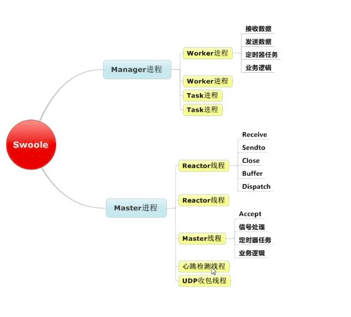

#### [官方文档](https://wiki.swoole.com/) [easySwoole](https://linkeddestiny.gitbooks.io/easy-swoole/content/)

#### Server
##### 流程图 

##### 进程/线程
~~~
Swoole是一个多进程模式的框架（可以类比Nginx的进程模型），
当启动一个Swoole应用时，一共会创建2 + n + m个进程，
其中n为Worker进程数，
m为TaskWorker进程数，
2为一个Master进程和一个Manager进程，
它们之间的关系如下图所示
~~~

##### 进程

##### worker `主要的业务逻辑处理`
* 对收到的数据进行处理，包括协议解析和响应请求。未设置 worker_num，底层会启动与 CPU 数量一致的 Worker 进程。
* 启动失败扩展内会抛出致命错误，请检查 php error_log 的相关信息。errno={number} 是标准的 Linux Errno，可参考相关文档。
* 如果开启了 log_file 设置，信息会打印到指定的 Log 文件中。 
   
##### task 
    针对耗时长的任务,Worker进程通过Unix Sock管道将数据发送给Task Worker.需要使用Redis、MySQL或者swoole_table来实现进程间共享数据

##### manager
    管理进程，该进程的作用是创建、管理所有的Worker进程和TaskWorker进程
    对所有 Worker 进程进行管理，Worker 进程生命周期结束或者发生异常时自动回收，并创建新的 Worker 进程
    
##### master
    主进程，该进程会创建Manager进程、Reactor线程等工作进/线程。Reactor线程实际运行epoll实例，用于accept客户端连接以及接收客户端数据
    主进程内有多个 Reactor 线程，基于 epoll/kqueue 进行网络事件轮询。收到数据后转发到 Worker 进程去处理

#### 结构
- [official](./official) 文档示例(old version) [web](https://wiki.swoole.com/wiki/page/1.html) 
- [wiki](./wiki) 文档示例(new version) [web](https://wiki.swoole.com/#/)      
     
#### For example
- [TCP-Sever](./official/AServer.php) [Official](https://wiki.swoole.com/wiki/page/p-server.html)
- [TCP-Client](./official/AClient.php) [Official](https://wiki.swoole.com/wiki/page/p-client.html)
- [Web-Server](./official/HttpServer.php) [Official](https://wiki.swoole.com/wiki/page/326.html)
- [WebSocket](./official/WebSocket.php) [Official](https://wiki.swoole.com/wiki/page/397.html)
- [WebSocketServerPush](./official/WebSocketServerPush.php)
- [Timer](./official/Timer.php) [Official](https://wiki.swoole.com/wiki/page/p-timer.html)

### 自绘图
{:height="100px" width="400px"}