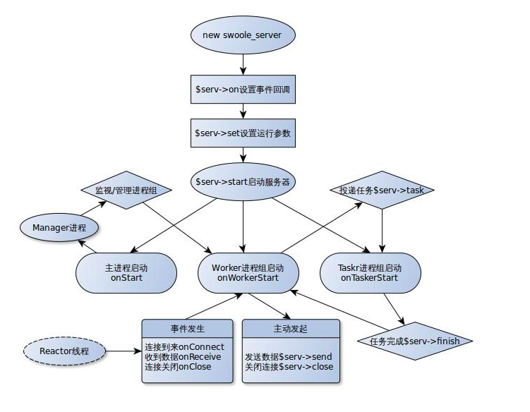

#### [官方文档](https://wiki.swoole.com/) [easySwoole](https://linkeddestiny.gitbooks.io/easy-swoole/content/)

#### Server
##### 流程图 

##### 进程/线程
~~~
Swoole是一个多进程模式的框架（可以类比Nginx的进程模型），
当启动一个Swoole应用时，一共会创建2 + n + m个进程，
其中n为Worker进程数，
m为TaskWorker进程数，
2为一个Master进程和一个Manager进程，
它们之间的关系如下图所示
~~~

##### 进程
* worker
    `主要的业务逻辑处理`
* task 
    `针对耗时长的任务,Worker进程通过Unix Sock管道将数据发送给Task Worker.需要使用Redis、MySQL或者swoole_table来实现进程间共享数据`
* manager
    `管理进程，该进程的作用是创建、管理所有的Worker进程和TaskWorker进程`
* master
    `主进程，该进程会创建Manager进程、Reactor线程等工作进/线程。
     Reactor线程实际运行epoll实例，用于accept客户端连接以及接收客户端数据`
     
     
#### For example
- [TCP-Sever](./official/AServer.php) [Official](https://wiki.swoole.com/wiki/page/p-server.html)
- [TCP-Client](./official/AClient.php) [Official](https://wiki.swoole.com/wiki/page/p-client.html)
- [Web-Server](./official/HttpServer.php) [Official](https://wiki.swoole.com/wiki/page/326.html)
- [WebSocket](./official/WebSocket.php) [Official](https://wiki.swoole.com/wiki/page/397.html)
- [WebSocketServerPush](./official/WebSocketServerPush.php)
- [Timer](./official/Timer.php) [Official](https://wiki.swoole.com/wiki/page/p-timer.html)